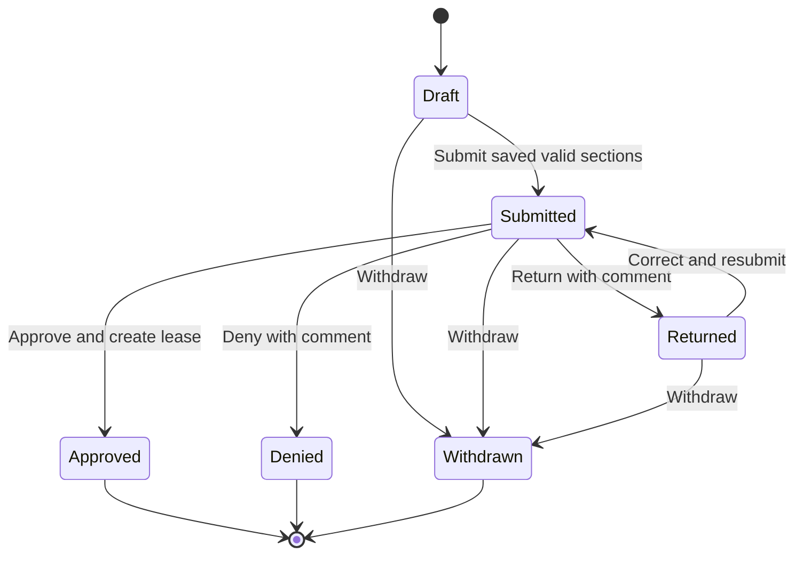

# Design and assessment coverage

## Structure

- `Domain`: entities, role constants, and statuses.
- `Data`: Identity/EF Core context, SQL Server migration and snapshot, design-time factory, and Bogus seed.
- `Services`: business rules, application workflow, catalog mutations, and the business clock.
- `ViewModels`: explicit input models and page projections; entity objects are never bound as posted input.
- `Controllers`: role authorization, ownership-scoped lookup, HTTP behavior, and validation responses.
- `Views`: Razor pages and reusable section/modal partials; application statistics are a view component.
- `wwwroot`: responsive CSS and a small modal controller in vanilla JavaScript. No SPA framework, JavaScript router, or client-side application store.
- `tests`: pure rules, relational workflow, MVC/Identity HTTP integration, and opt-in SQL Server concurrency/migration tests.

## Workflow and validation

One `ApplicationPage` view model drives a single application page. Its main form posts to `Applications/Edit`; the clicked button supplies `command`. Continue validates and saves the current section; Back redirects without saving posted fields. Submit reads the authoritative saved data and completion flags from the database, validates it again, and checks availability. A section number in a posted form is an input to dispatch, never permission to submit incomplete data.

The `_Information` and `_History` partials decide between fields and read-only content using the server-computed `Editable` flag and section. Summary invokes these same partials in read-only mode. Controller actions separately reject mutation outside Draft and Returned. A residence modal mutation invalidates history completion so the applicant must confirm that section again.

Data annotations define the information field rules. `ApplicationRules` adds history, date, status, review-comment, and inactive-type rules and is used by both controllers and services. Failed validation does not persist the section. At least one prior residence is required; move-out cannot precede move-in or be in the future. Dates on the same day are permitted.

## Modals

GET actions return the modal form partial. POST actions either return the same partial with ModelState errors or a small `{ "success": true }` result. The shared JavaScript re-renders invalid HTML in the open native dialog. A successful result closes the dialog and fetches the catalog or application-content partial. Event delegation supports controls inserted by refreshes. All mutation forms include an antiforgery token. AJAX requests receive 401/403 rather than login HTML.

## Permissions

Applicants see only queries constrained by their Identity user ID, including list, detail, section refresh, and residence actions. A foreign application returns 404. Managers can see all applications and edit the catalog, but cannot mutate applicant sections. Manager roles are required on every catalog and review mutation and on the corresponding modal GET actions. The UI mirrors these checks.

Manager-only status history includes the actor identity, UTC timestamp, old/new status, outcome, and comment. Applicants receive a separate feedback projection containing outcomes and comments without manager actor/history objects. Comments are deliberately applicant-visible review feedback; there is no private-notes feature in this submission. Razor encodes all user text.

## Database and concurrency

The EF Core model includes Identity tables plus Properties, Units, UnitTypes, Applications, Residences, StatusEvents, and Leases. Indexes cover applicant/status, unit/status, and lease date queries. Unit number is unique within its property; unit type names are unique; an application can have at most one lease. Check constraints protect rent, bedroom count, and date ordering. Restricting deletion of units with application/lease history preserves audit data; empty properties can be deleted together with their units.

Availability is a database `NOT EXISTS` query against leases covering the business date. Submission and approval both check it. Approval also rejects overlaps with future terms. The lease snapshots the current unit rent and uses an exclusive end date twelve months after its start. Competing applications are never automatically changed.

Submission and approval execute in serializable SQL Server transactions. A `SELECT` with `UPDLOCK, HOLDLOCK` locks the shared unit row before transactional application/lease reads and holds it through commit. This serializes decisions even when the unit initially has no lease. The lease creation, status update, and history insert commit together.

GUID concurrency tokens protect properties, units, and the whole application. Every application mutation changes the token. Residence changes also touch the application; a simultaneous Submit cannot silently ignore a residence edit. Stale form versions produce a reload message, and EF's update predicate prevents a race after the version check. This is intentionally one token per application because the optional multi-applicant / independent-section editing feature is outside scope.

Bogus seeding stores a completion marker in `SeedRuns` in the same transaction as demo data. Subsequent starts skip seeding, preserving renamed and deleted records. Databases seeded before the marker existed are recognized by their six application seed keys and marked complete without catalog changes. SQL Server seeding acquires an application lock and commits as one transaction. Roles are always created at startup even when demo data seeding is disabled.

## Requirement mapping

| Requirement | Implementation |
| --- | --- |
| .NET 10 MVC, Razor, controllers, view models | `Program.cs`, `Controllers`, `ViewModels`, `Views` |
| Partial views and view components | Section/modal/catalog partials; `ApplicationStatsViewComponent` |
| Partial-driven modals and in-place errors | `PropertiesController`, residence/review actions, `site.js` |
| ASP.NET Identity user/role management | Identity EF store, account controller, role authorization |
| Startup database/migrations and idempotent Bogus seed | `Program.cs`, `Data/Seeder.cs`, `Migrations` |
| SQL Server / code-first migrations | SQL Server provider and checked-in migration/snapshot |
| Unit tests for business logic | `RulesTests`, `WorkflowTests` |
| Signup/login/logout, selectable role | `AccountController`, account views |
| Property/unit add/edit/remove in modals | Catalog controller/service and modal partials |
| Inactive unit type display/assignment restriction | Type population and `ApplicationRules.RequireType` |
| Available browsing; twelve-month lease | Catalog lease filter; transactional approval |
| One-page, one-model, one-form section workflow | `ApplicationPage`, `Applications/Edit`, section partials |
| Continue persists only valid section; Back does not save | Edit dispatcher and application service |
| Residence modal CRUD | Residence and RemoveResidence GET/POST actions |
| Draft/Returned editable; other states read-only | Shared partial flags and controller/service checks |
| Availability checks at submit and approve | `SubmitAsync`, `ReviewAsync` |
| Approve/Return/Deny review modal with comment rules | Review partial and shared rules |
| Six statuses and terminal transitions | Domain enum and application service |
| Manager status/outcome history | Status events and timeline |
| Database status/property filtering and ownership | Application list query before count/paging/materialization |
| README with setup instructions | Root `README.md` |

Database paging/sorting are included as a small enhancement. The rest of the optional bonus scope is omitted to keep the required implementation focused.

## Framework references

The implementation uses standard [ASP.NET Core model validation](https://learn.microsoft.com/en-us/aspnet/core/mvc/models/validation?view=aspnetcore-10.0), [EF Core optimistic concurrency](https://learn.microsoft.com/en-us/ef/core/saving/concurrency), and [EF Core transactions](https://learn.microsoft.com/en-us/ef/core/saving/transactions).
